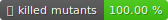

# Connection Hub

<p align="left">
   <a>
      
   </a>
   <a href="https://github.com/astral-sh/ruff">
      
   </a>
   <a href="https://github.com/gaems12/connection-hub/actions/workflows/lint-and-test.yaml">
      
   </a>
   <a href="https://github.com/gaems12/connection-hub/actions/workflows/lint-and-test.yaml">
      
   </a>
   <a href="https://codecov.io/gh/gaems12/connection-hub" >
      
   </a>
    <a href="https://github.com/gaems12/connect-four/actions/workflows/mutation-test.yaml">
      
   </a>
</p>

## 📜 License
This project is licensed under the Personal Use License. See the [LICENSE](LICENSE) file for details.

## 📚 Table of Contents

- [📦 Dependencies](#-dependencies)
- [🚀 Installation](#-installation)
  - [Using pip](#using-pip)
  - [Using uv](#using-uv)
  - [Using Docker](#using-docker)
- [⚙️ Environment Variables](#%EF%B8%8F-environment-variables)
- [🛠️ Commands](#%EF%B8%8F-commands)
  - [Create NATS Streams](#create-nats-streams)
  - [Run Message Consumer](#run-message-consumer)
  - [Run Task Scheduler](#run-task-scheduler)
  - [Run Task Executor](#run-task-executor)

## 📦 Dependencies

Ensure the following services are installed and running:

- **Redis**
- **NATS**
- **Centrifugo**

## 🚀 Installation

### Using uv (Recommended)

1. Create and activate a virtual environment:
   ```bash
   uv venv --python 3.13
   source ./.venv/bin/activate
   ```

2. Install dependencies:

   **For development**
   ```bash
   uv sync --all-extras --frozen
   ```

   **For production**
   ```bash
   uv sync --frozen
   ```

### Using pip

1. Create and activate a virtual environment:
   ```bash
   python3 -m venv .venv
   source ./.venv/bin/activate
   ```

2. Install dependencies:

   **For development:**
   ```bash
   pip install -e ".[dev]"
   ```

   **For production:**
   ```bash
   pip install -e .
   ```

### Using Docker (Recommended)

1. Build Docker image:

   ```bash
   docker build -t connection_hub:latest .
   ```

## ⚙️ Environment Variables

Configure the following environment variables before running the application:


<div align="center">

| Variable                         | Required            | Description                              |
|----------------------------------|---------------------|------------------------------------------|
| `LOGGING_LEVEL`                  | No (default: DEBUG) | Logging level                            |
| `REDIS_URL`                      | Yes                 | URL for the Redis instance.              |
| `NATS_URL`                       | Yes                 | URL for the NATS server.                 |
| `CENTRIFUGO_URL`                 | Yes                 | URL for the Centrifugo server.           |
| `CENTRIFUGO_API_KEY`             | Yes                 | API key for Centrifugo.                  |
| `LOBBY_MAPPER_LOBBY_EXPIRES_IN`  | No (default: 86400) | Lobby expiration time in seconds         |
| `GAME_MAPPER_GAME_EXPIRES_IN`    | No (default: 86400) | Game expiration time in seconds.         |
| `LOCK_EXPIRES_IN`                | No (default: 5)     | Lock expiration time in seconds.         |
| `TEST_REDIS_URL`                 | Yes (for tests)     | URL for the test Redis instance.         |
| `TEST_NATS_URL`                  | Yes (for tests)     | URL for the test NATS server.            |

</div>

## 🛠️ Commands

### Create NATS Streams

Create NATS streams with all subjects used by application to test it:
```bash
connection-hub create-nats-streams <nats_url>
```

### Run Message Consumer

Run the message consumer to process events from NATS:
```bash
connection-hub run-message-consumer
```

### Run Task Scheduler

Run the task scheduler:
```bash
connection-hub run-task-scheduler
```

### Run Task Executor

Run the task executor for scheduled tasks:
```bash
connection-hub run-task-executor
```
